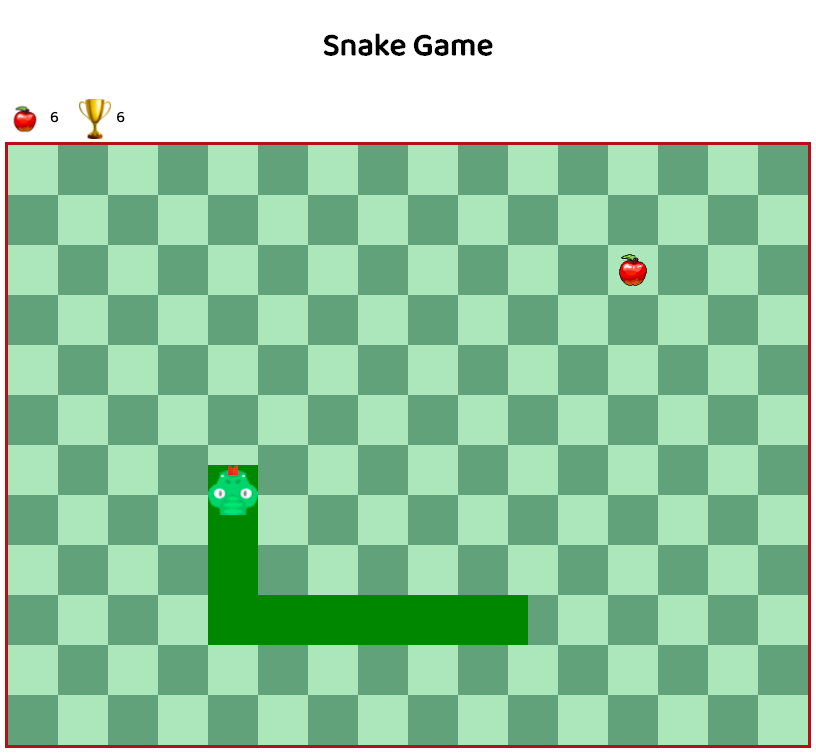

# Snake Game

Try it out! [Application Link](https://areyesfigueroa.github.io/SnakeGame/)

The application is based on the classic Snake Game.

## Description

The application was developed to experiment and get familiar with JavaScript canvas. The game is based on the classic snake game, where you control a snake that increases in length every time it eats an apple. The snake can be moved in four different directions using a grid-style system. You can do everything you could in the classic snake game, plus I added a small leaderboard so that you can always try to beat your last score.

## Technologies/Design

###### Technology Stack
- HTML, CSS, JavaScript

###### Other Tools
- Google's Draw.IO to help with initial project design and structure. [Diagram](https://drive.google.com/file/d/1IrkOeiGKDqX9PRSmVPc67onED0YTjIdj/view?usp=sharing)

NOTE: This diagram only shows the steps taken before starting the project. Does not represent final draft. 

## Author
- Aliel Reyes - Software Developer [LinkedIn](https://www.linkedin.com/in/alielreyes/).

